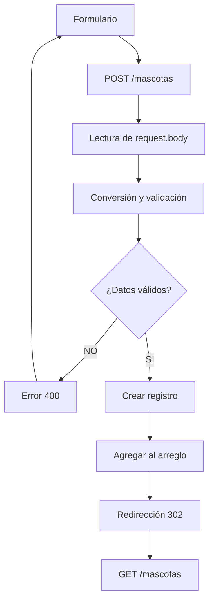

# Trabajo práctico 04

## Descripción

Este proyecto es el cuarto trabajo práctico solicitado en el módulo 3 de la Diplomatura en Desarrollo Web Full Stack con Javascript dictada por el Nodo Tecnológico de Catamarca.

Este README.md fue realizado parcialmente con IA para acortar tiempos, por lo que puede contener algo de inconsistencias o ambigüedad en la redacción... Fue una semana difícil.

Esta aplicación fue desarrollada con usando **Node.js, Express y EJS** para consultar mascotas en adopción y agregar temporalmente nuevos registros mediante un formulario.

La aplicación utiliza un archivo JSON como fuente de datos inicial, renderiza páginas HTML mediante EJS y permite crear nuevas mascotas únicamente en memoria durante la ejecución del servidor.

## Instalación

Clonar el repositorio y acceder a la carpeta del proyecto.:

```bash
git clone https://github.com/nedaro34/tp-04-ejs-aplicacion
cd tp-03-api-http-express
```

Instalar las dependencias con:

```bash
npm install
```

## Ejecución

Para iniciar la aplicación ejecuta:

```bash
npm start
```

El servidor se inicia utilizando el archivo:

```text
src/index.js
```

## Páginas y rutas

La aplicación cuenta con las siguientes rutas:

| Método | Ruta | Función |
|---|---|---|
|GET| `/` | Página inicial |
|GET| `/mascotas` | Listado de mascotas |
|GET| `/mascotas/nueva` | Formulario para agregar una mascota |
|GET| `/mascotas/:id` | Mostrar detalles de una mascota |
|POST| `/mascotas` | Validación y adición de una nueva mascota |

### Página inicial

Presenta el título principal del sitio, una breve explicación y un enlace hacia el catálogo de mascotas.

### Listado

Muestra una tarjeta por cada mascota contenida en el sistema. Cada tarjeta incluye:

- Nombre
- Especie
- Edad
- Estado
- Enlace para ver detalles de la mascota

Cuando la colección está vacía, se muestra un mensaje alternativo.

### Detalle

Busca una mascota por su identificador y muestra todos sus datos junto con su imagen y un texto alternativo apropiado.

Si el identificador no existe, la aplicación responde con estado **404** y renderiza la página HTML de error.

### Formulario

Permite ingresar una nueva mascota al sistema indicando:

- Nombre.
- Especie.
- Edad.
- Estado.
- Descripción.

## Estructura de vistas

Las vistas están organizadas de la siguiente manera:

```text
views/
├── layouts/
│   └── main.ejs
│
├── partials/
│   ├── encabezado.ejs
│   └── pie.ejs
│
├── mascotas/
│   ├── lista.ejs
│   ├── detalle.ejs
│   └── nueva.ejs
│
├── inicio.ejs
└── no-encontrado.ejs
```

### Layout

El layout es aquella estructura HTML en común que utilizarán las diversas páginas de un sitio web. Funciona a modo de plantilla para evitar repetir código y para organizar las vistas y parciales en un orden jerárquico:

### Vista

Una vista contiene el contenido específico de una página, ese contenido que suele encontrarse dentro de la etiqueta `<main>`. Por ejemplo, `lista.ejs` se encarga de representar el listado de mascotas y `detalle.ejs` representa los datos de una mascota individual.

### Parcial

Un parcial es un fragmento reutilizable de una página que no ahorra la molestia de repetir código. En este proyecto se utilizan los parciales `encabezado.ejs` y `pie.ejs`, que permiten mantener la navegación y el pie de página de forma compartida sin tener que escribirlos repetidamente en varios archivos.

## Recursos estáticos

Los recursos estáticos se encuentran dentro de `public/`:

```text
public/
├── css/
│   └── estilos.css
├── img/
│   └── mascota.svg
└── js/
    └── app.js
```

Express los sirve mediante:

```js
app.use(express.static(path.join(__dirname, "..", "public")));
```

Por este motivo, las URLs utilizadas en HTML no incluyen `/public`.

Los recursos disponibles son:

- `/css/estilos.css`: hoja de estilos en cascada.
- `/img/mascota.svg`: imagen SVG local.
- `/js/app.js`: archivo JavaScript estático con un mensaje en la consola.

## Formulario

El formulario utiliza `express.urlencoded({ extended: false })` para poder recibir los datos enviados mediante `POST`.

En `POST /mascotas` se realiza el siguiente proceso:

1. Se leen los datos mediante `request.body`.
2. La edad se convierte a número.
3. Se comprueba que los campos estén completos.
4. Se valida que la edad sea válida.
5. Si existe un error, se responde con estado **400** y se vuelve a renderizar el formulario.
6. El mensaje de error se muestra con `role="alert"`.
7. Los valores introducidos por el usuario se conservan.
8. Si los datos son válidos, se genera un identificador para la mascota nueva.
9. Se asigna `/img/mascota.svg` como imagen.
10. La nueva mascota se agrega al arreglo en memoria.
11. Se redirige al listado mediante `/mascotas`.


En síntesis, el flujo principal para crear una mascota es:



No se modifica el archivo `datos/mascotas.json` al crear una mascota nueva, por lo que la información nueva permanecerá en memoria hasta que se reinicie el servidor..

## Persistencia de los datos

Los registros iniciales se cargan desde:

```text
datos/mascotas.json
```

Las nuevas mascotas se agregan solamente al arreglo que se encuentra cargado en memoria durante la ejecución del servidor.

Por este motivo, **los nuevos registros no son persistentes**. Al reiniciarel servidor, el arreglo vuelve a cargarse desde el archivo JSON original y las mascotas agregadas mediante el formulario desaparecen.

Esto se realizó así según lo solicitado para este trabajo: no se utiliza base de datos ni se escriben nuevos registros en el archivo JSON.